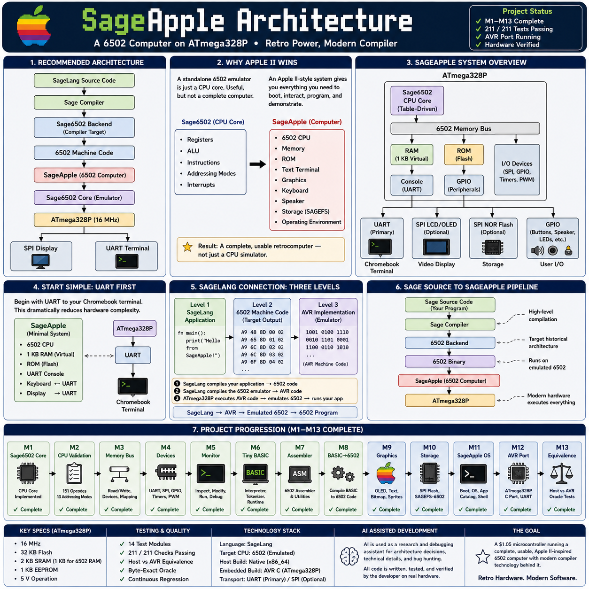

# SageApple



An **Apple II-inspired retrocomputer** implemented primarily in **pure
SageLang**, targeting an inexpensive **ATmega328P / Arduino UNO R3-compatible**
board.

At its core is a reusable **Sage6502 CPU core** — a table-driven NMOS 6502
interpreter — plus a **SageLang-to-6502 compiler backend**, a complete
SageApple machine (bus, devices, Tiny BASIC, monitor, OS, filesystem), and
a **real ATmega328P port** where the core is re-implemented in C and runs on
the chip over a physical UART.

```
                    ┌───────────────────────────────┐
                    │  apps/catalog            apps │
                    ├───────────────────────────────┤
                    │  sageapple/   OS · filesystem │
                    │               graphics ·      │
                    │               monitor         │
                    ├───────────────────────────────┤
                    │  basic/   Tiny BASIC          │
                    ├───────────────────────────────┤
                    │  compiler/ asm6502 + backend  │
                    ├───────────────────────────────┤
                    │  bus/ + devices/              │
                    ├───────────────────────────────┤
                    │  sage6502/  CPU core          │
                    ├───────────────────────────────┤
                    │  avr/   C runtime + C port    │
                    └───────────────────────────────┘
```

- All layers run under the host `sage` interpreter (full emulation) **or**
  on the real 328P (C core + monitor ROM in PROGMEM).
- The same terminal session — `help dump peek poke regs run reset` — is a
  byte-exact transcript check between host and chip.

## Status

**Complete** — all milestones done; the machine runs both emulated and on
hardware:

| Milestone | Deliverable |
|---|---|
| M1 | Repository, PLAN, README, license |
| M2 | Sage6502 CPU core (instruction table, addressing modes, IRQ/NMI, BRK/RTI) |
| M3 | CPU + opcode validation suites |
| M4 | AVR target (linker, startup, UART runtime, make/avrdude flow) |
| M5 | Boot ROM, reset vector, memory bus, RAM + ROM |
| M6 | UART device on `$2000-$2001`, terminal I/O |
| M7 | 6502 monitor (`help dump peek poke regs run reset`) |
| M8 | Tiny BASIC (PRINT/LET/GOTO/IF/FOR/NEXT/INPUT/LIST/RUN/NEW) |
| M9 | 6502 compiler backend (expressions, PRINT/LET/GOTO/IF/DIV) |
| M10 | SPI SSD1306-style OLED (pixel/line/5x7 text) |
| M11 | SPI NOR flash + SAGEFS-6502 filesystem (BASIC persistence) |
| M12 | Standalone OS: speaker, boot menu, catalog apps, monitor interop |
| M13 | Real AVR silicon: C port of the core, PROGMEM opcode table, host-oracle equivalence, verified flash+run on the board |

Host suites: **14 modules, 220 checks passing** — plus the AVR host
equivalence test (`make host-test`).

## Architecture

Two execution backends, one machine:

```
SageLang machine            AVR machine
sageapple/machine.sage      avr/main.c + avr/sage6502.c
        │                           │
        ▼                           ▼
  bus/applebus.sage           avr/bus.c (SRAM/PROGMEM)
        │                           │
  sage6502/cpu.sage            avr/sage6502.c (same core)
```

The opcode table, ROM, and the canonical terminal session are all
*generated* from the Sage sources (`tools/rom_gen.sage`,
`tools/gen_table.sage`) so the C port cannot drift.

## Memory / I/O map

| Range | Device |
|---|---|
| `$0000-$07FF` | 2 KB RAM (host); `$0000-$03FF` 1 KB on the AVR |
| `$2000-$2001` | UART (status/RX/TX) |
| `$2002-$2004` | SPI display controller (command/data/status+reset) |
| `$2005-$2006` | SPI flash controller (byte transfer / CS level) |
| `$2007` | PWM-speaker frequency |
| `$3000` | legacy console TX alias |
| `$8000-$FFFF` | 32 KB Program ROM (read-only) |

## Documentation

Component docs live in [docs/](docs/architecture.md):

| doc | topic |
|---|---|
| architecture | layers, design decisions, execution models |
| sage6502 | CPU core, tables, registers, flags |
| bus | bus.sage + AppleBus memory map |
| devices | UART · SPI · OLED · NOR flash · speaker |
| basic | Tiny BASIC interpreter |
| compiler | asm6502 assembler + BASIC→6502 backend |
| os | OS console · monitor · SAGEFS · graphics |
| avr | hardware port, build, flash, on-board session |
| tools | oracle/ROM/table generators |
| tests | validation suites and how to run them |

## Quick start (host)

```sh
sage tools/avr_boot.sage         # assemble + emit build/boot.bin & boot.hex
sage tests/machine/test_os.sage  # full end-to-end OS check (23 checks)
```

All 14 suites run the same way; see [docs/tests.md](docs/tests.md).

## Hardware

See [docs/avr.md](docs/avr.md) — the short version:

```sh
cd avr
make                                    # sageapple.hex (the 6502 emulator)
make flash DEVICE=/dev/ttyUSB0 BAUD=115200 PROTO=arduino
make host-test                          # host equivalence oracle
screen /dev/ttyUSB0 9600               # talk to the monitor on the UNO
```

The board boots straight into the monitor over the physical UART:

```
SageApple MonitorMON> help
Commands: help dump peek poke regs run reset
MON> regs
A=00 X=FD Y=11 SP=FD P=68
```

Fuses (USBasp): `-U lfuse:w:0xFF:m -U hfuse:w:0xD9:m -U efuse:w:0xFF:m`
(16 MHz external crystal).

## Test suite

Run any module standalone, or all 14:

```sh
for t in tests/*/*.sage; do sage "$t"; done   # 220 checks, all OK
```

## Repository layout

```
apps/          installable apps (HELLO / COUNTER / BEEP / MACHINE1)
avr/           AVR runtime + C port of the core (make / avrdude)
basic/         Tiny BASIC interpreter
bus/           applebus.sage (memory map) + flat bus
compiler/      asm6502 (assembler) + backend (BASIC -> 6502)
devices/       UART, SPI, display, flash, speaker models
docs/          component documentation
sageapple/     os.sage, monitor.sage, storage.sage (SAGEFS), graphics.sage
sage6502/      CPU core (cpu.sage, registers, IRQ/NMI)
tools/         oracle/ROM/table generators
tests/         14 suites, 220 checks
```

## License

MIT — see [LICENSE](LICENSE); full history in [CHANGELOG.md](CHANGELOG.md),
design in [PLAN.md](PLAN.md).
