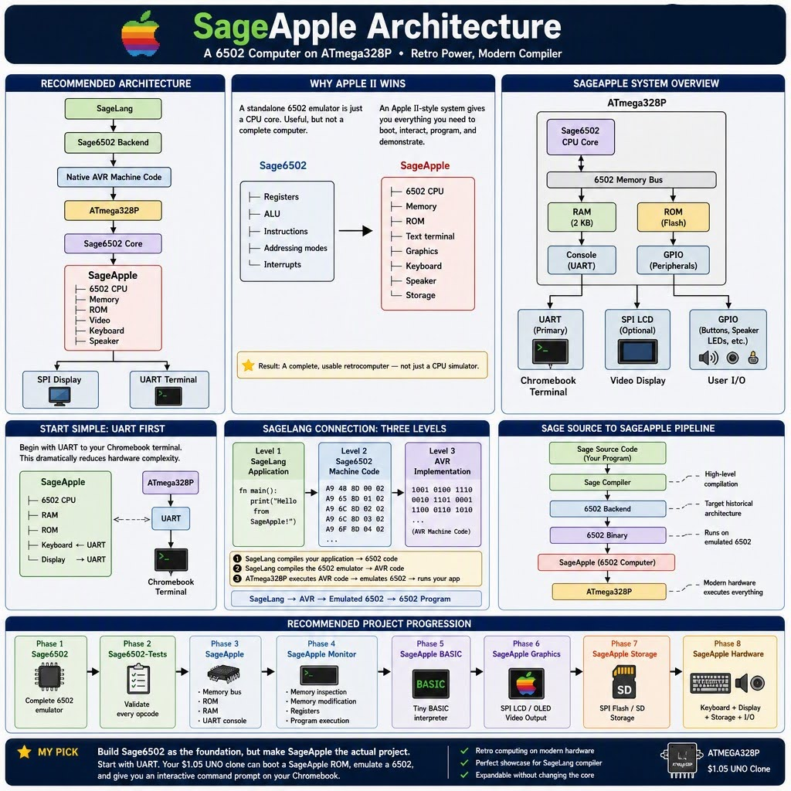

# SageApple

An **Apple II-inspired retrocomputer** implemented primarily in **pure SageLang**, targeting an inexpensive **ATmega328P / Arduino UNO R3-compatible** board.

At its core is a reusable **Sage6502 CPU core** and a future **SageLang-to-6502 compiler backend**. Phase 1 focuses on a **UART terminal** interface to make a functional, interactive computer while staying within the ATmega328P's tight SRAM/I/O budget.

See [`PLAN.md`](PLAN.md) for the full architecture, phases, and milestones.

## Status

Under construction — Milestone 1 (repository scaffold).